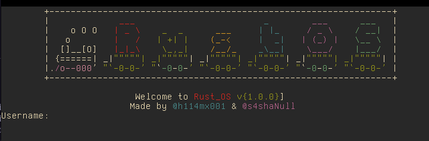

# my_rust_os 🦀



An OS in Rust from scratch. This project belongs to the course COMP3080/COMP4060 - Course-related Project at VinUniversity. 

Made by: @h114mx001 & @s4shaNull

The OS started from this [series](https://os.phil-opp.com/) of **Writing an OS in Rust** by Philipp Oppermann, with additional development with the help of [OSDev Wiki](https://wiki.osdev.org/Main_Page) and other open sources projects. 

## Setup  

### Prerequisites 

You will need `git`, `gcc`, `make`, `curl`, `qemu-img`, and `qemu-system-x86-64` on the host system. 

### Build by source code

1. Clone the repo
```
$ git clone https://github.com/h114mx001/my_rust_os
$ cd my_rust_os 
```
2. Install required tools: 

You can either run `make setup` or following commands: 

```
$ curl https://sh.rustup.rs -sSf | sh -s -- -y --default-toolchain none
$ rustup show
$ cargo install bootimage
```

## Usage 

1. Build a Rust_OS disk image `disk.img`. 

`$ make image output=video`

2. Run Rust_OS in QEMU:

`$ make qemu output=video`

3. After running, diskless mode of the OS will be run. You can start installing the OS by the command:

`> install`

4. Setup your username & password. You've done!

## Tests 

In order to make sure all the part of the OS is good enough, run the test suite: 

`$ make test`

## License

Rust_OS is released under MIT License.
